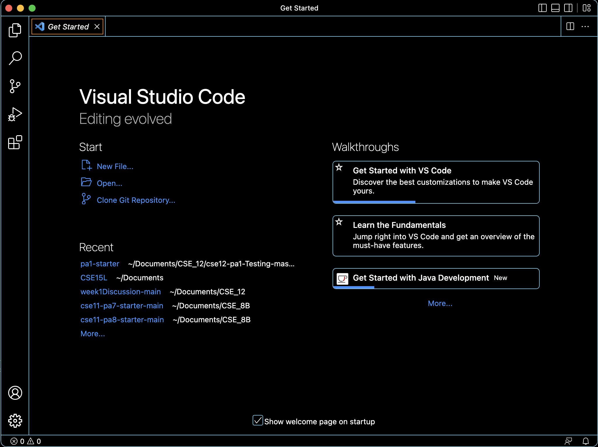
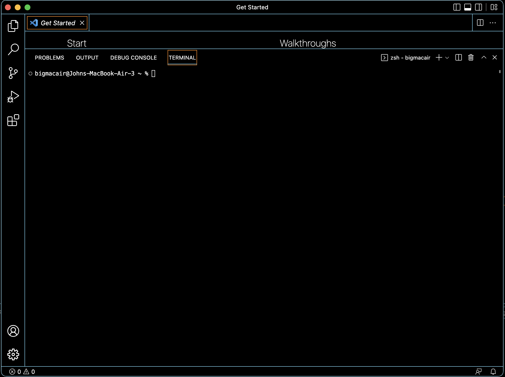
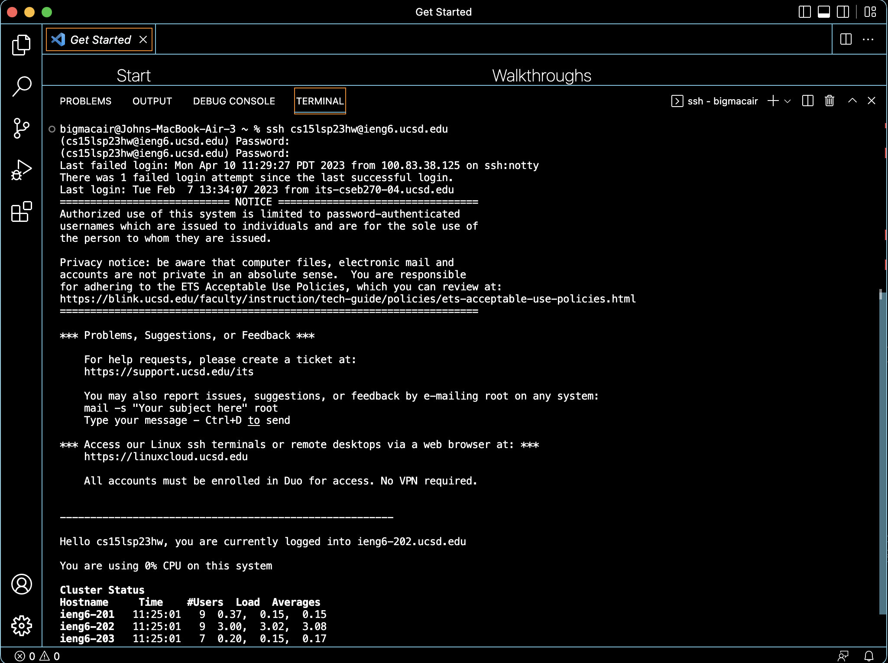

Hello, if you're here, then you must be looking for a tutorial on how to connect remotely using your ieng6 account through vscode.  
# Part 1  
Please go to [https://code.visualstudio.com/](https://code.visualstudio.com/), follow the instructions given by the website, download and install visual studio code. 
Once installed, open visual studio code,  
  
and open a new terminal using your os specific ui element.  
  
With terminal open, input this command : ssh cs15lsp23`zz`@ieng6.ucsd.edu but with `zz` replaced by your cse15L account username.  
You need to know your password for this account, if you do not have your password you must go to [https://sdacs.ucsd.edu/~icc/index.php](https://sdacs.ucsd.edu/~icc/index.php), reset your 
password and make a new one.  
Once you have done that, you can input your password, linux will not let you see what you are typing in this stage but you definitely are typing.  
  
These are commands you can try:  
`cd ~`  
`cd`   
`ls -lat` 
`ls -a`  
You can find more commands online.  
With that, you can now access the remote server for CSE 15L.
