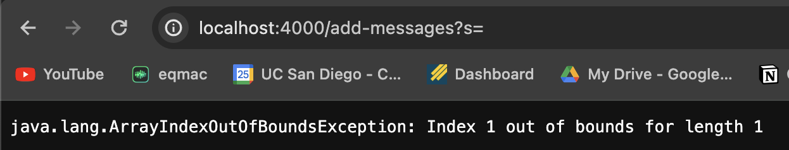

# Lab Report 2 - Servers and SSH Keys (Week 3)

## Part 1

My code 
 

- Which methods in your code are called? The handleRequest method is called.
- What are the relevant arguments to those methods, and the values of any relevant fields of the class? The relevant argument is the url given. When the correct format is observed, strings are added. The relevant fields used are StringBuilder addedStrings and int stringCount, with StringBuilder being used to create new string entries onto the page and stringCount to increment the number of strings.
- How do the values of any relevant fields of the class change from this specific request? If no values got changed, explain why. The value of StringBuilder changes to create the strings "hello" and "goodbye". The value of stringCount changes to increment when a new string is added.

 
- Which methods in your code are called? The handeRequest method is called again.
- What are the relevant arguments to those methods, and the values of any relevant fields of the class? The relevant argument is the url given. The relevant fields are StringBuilder addedStrings and int stringCount.
- How do the values of any relevant fields of the class change from this specific request? If no values got changed, explain why. In this case no values were changed because no string was specified, resulting in an index out of bounds error.

## Part 2

SSH private key

SSH public Key 

Terminal Interaction

