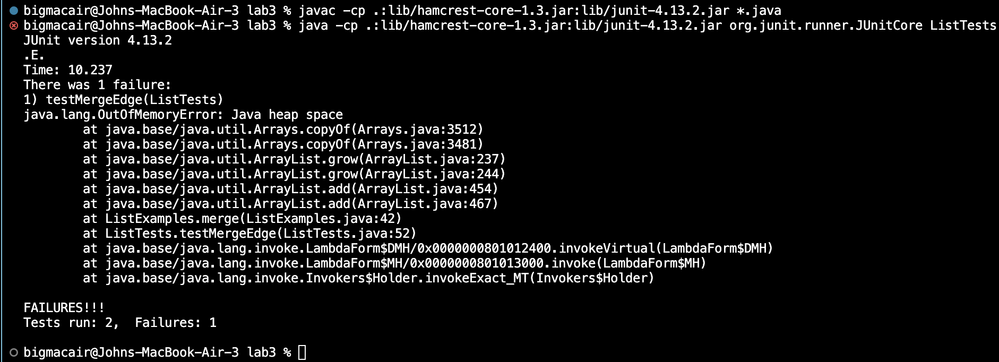

# Part 1

```
@Test
public void testMerge() {
    ArrayList<String> strings = new ArrayList<>();
    strings.add("z");
    strings.add("b");
    strings.add("c");
    strings.add("d");
    strings.add("e");
    ArrayList<String> strings2 = new ArrayList<>();
    strings2.add("a");
    strings2.add("b");
    strings2.add("c");
    strings2.add("d");
    strings2.add("e");
    ArrayList<String> expected = new ArrayList<String>();
    expected.add("a");
    expected.add("b");
    expected.add("b");
    expected.add("c");
    expected.add("c");
    expected.add("d");
    expected.add("d");
    expected.add("e");
    expected.add("e");
    expected.add("z");
    List<String> actualUnconverted = ListExamples.merge(strings, strings2);
    ArrayList<String> actualConverted = new ArrayList<String>(actualUnconverted);
    assertEquals(expected, actualConverted);
	}
```

```
@Test 
public void testMergeEdge() {
    ArrayList<String> strings = new ArrayList<>();
    strings.add("a");
    strings.add("b");
    strings.add("c");
    strings.add("d");
    strings.add("e");
    ArrayList<String> strings2 = new ArrayList<>();
    strings2.add("a");
    strings2.add("b");
    strings2.add("c");
    strings2.add("d");
    strings2.add("e");
    ArrayList<String> expected = new ArrayList<String>();
    expected.add("a");
    expected.add("a");
    expected.add("b");
    expected.add("b");
    expected.add("c");
    expected.add("c");
    expected.add("d");
    expected.add("d");
    expected.add("e");
    expected.add("e");
    List<String> actualUnconverted = ListExamples.merge(strings, strings2);
    ArrayList<String> actualConverted = new ArrayList<String>(actualUnconverted);
    assertEquals(expected, actualConverted);
	}
```




```
  // Takes two sorted list of strings (so "a" appears before "b" and so on),
  // and return a new list that has all the strings in both lists in sorted order.
  static List<String> merge(List<String> list1, List<String> list2) {
    List<String> result = new ArrayList<>();
    int index1 = 0, index2 = 0;
    while(index1 < list1.size() && index2 < list2.size()) {
      if(list1.get(index1).compareTo(list2.get(index2)) < 0) {
        result.add(list1.get(index1));
        index1 += 1;
      }
      else {
        result.add(list2.get(index2));
        index2 += 1;
      }
    }
    while(index1 < list1.size()) {
      result.add(list1.get(index1));
      index1 += 1;
    }
    while(index2 < list2.size()) {
      result.add(list2.get(index2));
      index1 += 1; //incrementing index1 instead of index 
    }
    return result;
  }
```


```
  // Takes two sorted list of strings (so "a" appears before "b" and so on),
  // and return a new list that has all the strings in both lists in sorted order.
  static List<String> merge(List<String> list1, List<String> list2) {
    List<String> result = new ArrayList<>();
    int index1 = 0, index2 = 0;
    while(index1 < list1.size() && index2 < list2.size()) {
      if(list1.get(index1).compareTo(list2.get(index2)) < 0) {
        result.add(list1.get(index1));
        index1 += 1;
      }
      else {
        result.add(list2.get(index2));
        index2 += 1;
      }
    }
    while(index1 < list1.size()) {
      result.add(list1.get(index1));
      index1 += 1;
    }
    while(index2 < list2.size()) {
      result.add(list2.get(index2));
      index2 += 2; //now incrementing index2 instead of index1
    }
    return result;
  }
```
This fix addresses the issue because instead of incrementing index1 it now increments index2 which allows the second list to be properly added to the final merged list. What happens before seems to be some infinite loop as java runs out of memory in the heap.

# Part 2
grep

Option 1: -m
Example 1:

input: 
```
grep -m 10 "rna" FindLabReport.txt > grepLabReport.txt
```
output:
```
technical//government/Gen_Account_Office/InternalControl_ai00021p.txt
technical//plos/journal.pbio.0030032.txt
technical//plos/journal.pbio.0020354.txt
technical//plos/journal.pbio.0020156.txt
technical//plos/journal.pbio.0020140.txt
technical//plos/journal.pbio.0020183.txt
technical//plos/journal.pbio.0020430.txt
technical//plos/journal.pbio.0020394.txt
technical//plos/journal.pbio.0020431.txt
technical//plos/journal.pbio.0020419.txt
```
-m is useful if you are searching a large amount of files and want to limit your output to something easily readable. In this example I looked for any .txt files containing "rna" and I only wanted the first 10.

Example 2:

input:
```
grep -m 10 -v "911" FindLabReport.txt > grepLabReport.txt
```
output:
```
technical//government/About_LSC/LegalServCorp_v_VelazquezSyllabus.txt
technical//government/About_LSC/Progress_report.txt
technical//government/About_LSC/Strategic_report.txt
technical//government/About_LSC/Comments_on_semiannual.txt
technical//government/About_LSC/Special_report_to_congress.txt
technical//government/About_LSC/CONFIG_STANDARDS.txt
technical//government/About_LSC/commission_report.txt
technical//government/About_LSC/LegalServCorp_v_VelazquezDissent.txt
technical//government/About_LSC/ONTARIO_LEGAL_AID_SERIES.txt
technical//government/About_LSC/LegalServCorp_v_VelazquezOpinion.txt
```
In this example I use -v to invert the condition after 10 non-matching lines which is useful if you want to exclude results from your search.


Option 2: -H
Example 1:

input:
```
grep -H "911" FindLabReport.txt > grepLabReport.txt
```
output:
```
FindLabReport.txt:technical//911report/chapter-13.4.txt
FindLabReport.txt:technical//911report/chapter-13.5.txt
FindLabReport.txt:technical//911report/chapter-13.1.txt
FindLabReport.txt:technical//911report/chapter-13.2.txt
FindLabReport.txt:technical//911report/chapter-13.3.txt
FindLabReport.txt:technical//911report/chapter-3.txt
FindLabReport.txt:technical//911report/chapter-2.txt
FindLabReport.txt:technical//911report/chapter-1.txt
FindLabReport.txt:technical//911report/chapter-5.txt
FindLabReport.txt:technical//911report/chapter-6.txt
FindLabReport.txt:technical//911report/chapter-7.txt
FindLabReport.txt:technical//911report/chapter-9.txt
FindLabReport.txt:technical//911report/chapter-8.txt
FindLabReport.txt:technical//911report/preface.txt
FindLabReport.txt:technical//911report/chapter-12.txt
FindLabReport.txt:technical//911report/chapter-10.txt
FindLabReport.txt:technical//911report/chapter-11.txt
```
-H is useful for knowing the source of an output redirection.

Example 2:

input:
```
grep -H  "Afghanistan" technical/911report/* > grepLabReport.txt
```

output:
```
technical/911report/chapter-10.txt:                States had to make it clear to Pakistan, Afghanistan, and the Arab states that the
technical/911report/chapter-10.txt:                have harbored the attackers, including Iraq, Afghanistan, Libya, Sudan, and Iran. He
technical/911report/chapter-10.txt:                    to Afghanistan; and,
technical/911report/chapter-10.txt:                Pakistan and Afghanistan." The paper took it as a given that Bin Ladin would
technical/911report/chapter-10.txt:                Defense would plan to build an international coalition to go into Afghanistan. Both
technical/911report/chapter-10.txt:                to invade Afghanistan with ground troops.
technical/911report/chapter-10.txt:                Afghanistan. The existing Infinite Resolve options did not, in his view, amount to
technical/911report/chapter-10.txt:                proposed inserting CIA teams into Afghanistan to work with Afghan warlords who would
technical/911report/chapter-10.txt:            General Shelton briefed the principals on the preliminary plan for Afghanistan that
technical/911report/chapter-10.txt:                prepared to notify Russia and countries near Afghanistan when hostilities were
technical/911report/chapter-10.txt:                in Afghanistan, including the administration's first Memorandum of Notification on
technical/911report/chapter-10.txt:                regarding a two-day visit to Afghanistan during which the Pakistani intelligence
technical/911report/chapter-10.txt:                Afghanistan. The new directive-formally signed on October 25, after the fighting in
technical/911report/chapter-10.txt:                Afghanistan had already begun-included new material followed by annexes discussing
technical/911report/chapter-10.txt:                the September 11 Attacks." Rice's chief staffer on Afghanistan, Zalmay Khalilzad,
technical/911report/chapter-10.txt:                worry about Iraq in the following week, Powell said, President Bush saw Afghanistan
technical/911report/chapter-10.txt:                15 afternoon session, which dealt solely with Afghanistan.
technical/911report/chapter-10.txt:                focus would be on Afghanistan, although he still wanted plans for Iraq should the
technical/911report/chapter-10.txt:                Qaeda, and Afghanistan.
technical/911report/chapter-10.txt:                and al Qaeda in Afghanistan. But, he told us, he now wondered how that action was
technical/911report/chapter-10.txt:            President Bush approved military plans to attack Afghanistan in meetings with Central
technical/911report/chapter-10.txt:                alone-to the operational name still used for operations in Afghanistan:"Enduring
technical/911report/chapter-10.txt:                    regime and eliminate al Qaeda's sanctuary in Afghanistan. Mazar-e-Sharif, in
technical/911report/chapter-10.txt:                    northern Afghanistan, fell to a coalition assault by Afghan and U.S. forces on
technical/911report/chapter-10.txt:                    Pashtun leader from Kandahar, was installed as the chairman of Afghanistan's
technical/911report/chapter-10.txt:                    interim administration. Afghanistan had been liberated from the rule of the
technical/911report/chapter-11.txt:                a kind of cultural asymmetry. To us, Afghanistan seemed very far away. To members of
technical/911report/chapter-11.txt:                occupation of Afghanistan, the intelligence community did not describe this
technical/911report/chapter-11.txt:                with the threat was to end al Qaeda's ability to use Afghanistan as a sanctuary for
technical/911report/chapter-11.txt:                was not given the mission of ending al Qaeda's sanctuary in Afghanistan.
technical/911report/chapter-11.txt:                of Afghanistan as practically inconceivable before 9/11. It was never the subject of
technical/911report/chapter-11.txt:                Afghanistan itself or nearby-openly, clandestinely (secretly), or covertly (with
technical/911report/chapter-11.txt:                substantial ground forces in Afghanistan, its odds of sucess are hard to calculate.
technical/911report/chapter-11.txt:                more direct intervention against the sanctuary in Afghanistan apparently must have
technical/911report/chapter-11.txt:                tip the balance in Afghanistan's ongoing civil war. The United States had warned the
technical/911report/chapter-11.txt:                Afghanistan's U.S. interests. The warning had been given in 1998, again in late
technical/911report/chapter-11.txt:                missile strikes in Afghanistan, naval vessels remained on station in or near the
technical/911report/chapter-11.txt:                using Special Operations Forces in Afghanistan and that they hoped for action
technical/911report/chapter-12.txt:                on both Iraq and Afghanistan), homeland security, and international affairs rose
technical/911report/chapter-12.txt:                Afghanistan. The language of war also evokes the mobilization for a national effort.
technical/911report/chapter-12.txt:                western Pakistan and the Pakistan-Afghanistan border region
technical/911report/chapter-12.txt:                southern or western Afghanistan
technical/911report/chapter-12.txt:                insufficient attention to Afghanistan, the rule of the Taliban or warlords and
technical/911report/chapter-12.txt:                Pakistan, Afghanistan, and Saudi Arabia.
technical/911report/chapter-12.txt:                in Afghanistan. Almost all the 9/11 attackers traveled the northsouth nexus of
technical/911report/chapter-12.txt:                difficult terrain. On the other side of the frontier, U.S. forces in Afghanistan
technical/911report/chapter-12.txt:                Afghanistan.
technical/911report/chapter-12.txt:            Afghanistan
technical/911report/chapter-12.txt:            Afghanistan was the incubator for al Qaeda and for the 9/11 attacks. In the fall of
technical/911report/chapter-12.txt:                10,000 American soldiers are deployed today in Afghanistan, joined by soldiers from
technical/911report/chapter-12.txt:                Afghanistan is near the brink of chaos.
technical/911report/chapter-12.txt:            Battered Afghanistan has a chance. Elections are being prepared. It is revealing that
technical/911report/chapter-12.txt:            Afghanistan's president, Hamid Karzai, is brave and committed. He is trying to build
technical/911report/chapter-12.txt:                a democratic government to Afghanistan, the United States faces some difficult
technical/911report/chapter-12.txt:            After paying relatively little attention to rebuilding Afghanistan during the
technical/911report/chapter-12.txt:                package of assistance signaled a longer-term commitment to Afghanistan's future. One
technical/911report/chapter-12.txt:                Afghanistan again, as it had in the 1990s. Another Afghan leader noted that if the
technical/911report/chapter-12.txt:            Most difficult is to define the security mission in Afghanistan. There is continuing
technical/911report/chapter-12.txt:                on the scale of America's commitment to the future of Afghanistan. The United States
technical/911report/chapter-12.txt:                    their efforts in Afghanistan so far. Now the United States and the international
technical/911report/chapter-12.txt:                    community should make a long-term commitment to a secure and stable Afghanistan,
technical/911report/chapter-12.txt:                    the Afghan people. Afghanistan must not again become a sanctuary for
technical/911report/chapter-12.txt:                NATO in particular has made Afghanistan a test of the Alliance's ability to
technical/911report/chapter-12.txt:                    assistance to Afghanistan are not fulfilling their pledges.
technical/911report/chapter-12.txt:                The U.S. presence in Afghanistan is overwhelmingly oriented toward military
technical/911report/chapter-12.txt:                    Somalia, Bosnia, Kosovo, Afghanistan, and Iraq. If the United States does not
technical/911report/chapter-12.txt:                        television and radio broadcasting to the Arab world, Iran, and Afghanistan.
technical/911report/chapter-13.1.txt:                The post-9/11 Afghanistan precedent of using joint CIA-military teams for
technical/911report/chapter-13.3.txt:                War in Afghanistan; History and Harbinger of Future War?" Military Review (Fort
technical/911report/chapter-13.3.txt:                Historical Background of the Islamic Army and bin Ladin's Move from Afghanistan to
technical/911report/chapter-13.3.txt:                Arab fi Afghanistan (The Arab volunteers in Afghanistan) (Benevolence International
technical/911report/chapter-13.3.txt:                Afghanistan. See also CIA analytic report, "Al-Qa'ida in Sudan, 1992-1996: Old
technical/911report/chapter-13.3.txt:                bin Ladin's Move from Afghanistan to Sudan, Nov. 26, 1996.
technical/911report/chapter-13.3.txt:                Ladin's Move from Afghanistan to Sudan, Nov. 26, 1996; CIA analytic report, "Old
technical/911report/chapter-13.3.txt:                Background of the Islamic Army and bin Ladin's Move from Afghanistan to Sudan, Nov.
technical/911report/chapter-13.3.txt:                Afghanistan. On the Blind Sheikh, Bin Ladin eventually spoke publicly of his
technical/911report/chapter-13.3.txt:                information is puzzling, since Bin Ladin left Sudan for Afghanistan in May 1996, and
technical/911report/chapter-13.3.txt:                CIA, Afghanistan, and bin Laden, from the Soviet Invasion to September 10, 2001
technical/911report/chapter-13.3.txt:                in Pakistan, Afghanistan, and India, July 14, 1997; FBI investigation, interview of
technical/911report/chapter-13.3.txt:                Afghanistan-Pakistan-centered network of guesthouses and training camps, see CIA
technical/911report/chapter-13.3.txt:                On relations between the Arabs in Afghanistan and the Taliban, see ibid. On
technical/911report/chapter-13.3.txt:            78. CIA analytic report, "Afghanistan: An Incubator for International Terrorism," CTC
technical/911report/chapter-13.3.txt:                (translation of "Clergymen in Afghanistan Issue a Fatwa calling for the Removal of
technical/911report/chapter-13.3.txt:                1998 (conducted in Afghanistan by ABC News producer Rahimullah Yousafsai).
technical/911report/chapter-13.3.txt:                The Secret History of the CIA, Afghanistan, and bin Laden, from the Soviet Invasion
technical/911report/chapter-13.3.txt:                us that he counseled the company about the internal dynamics of Afghanistan and
technical/911report/chapter-13.3.txt:                Wars: The Secret History of the CIA, Afghanistan, and bin Laden, from the Soviet
technical/911report/chapter-13.3.txt:            62. DOS cable, Islamabad 06863, "Afghanistan: Demarche toTaliban on New Bin
technical/911report/chapter-13.3.txt:                to assemble an anti-Taliban ruling coalition inside and outside Afghanistan. Peter
technical/911report/chapter-13.3.txt:                Afghanistan and the UAE. Judy Pasternak and Stephen Braun, "Emirates Looked Other
technical/911report/chapter-13.3.txt:                rumors that high-level UAE officials were in Afghanistan. NSC email, Clarke to
technical/911report/chapter-13.3.txt:                Level UAE Visits to Afghanistan,"Feb.19,1999. General Shelton also told us that his
technical/911report/chapter-13.3.txt:                UAE counterpart said he had been hunting at a desert camp in Afghanistan at about
technical/911report/chapter-13.4.txt:                nonsense word he adopted after hearing it on the front lines in Afghanistan).
technical/911report/chapter-13.4.txt:                12, 2003 (in which KSM recounts how he knew Wali Khan from Afghanistan). On the
technical/911report/chapter-13.4.txt:                23, 1999. On the Sudanese trip and Afghanistan, see Intelligence report,
technical/911report/chapter-13.4.txt:                account of this episode dates his return to Afghanistan in 1996, the 1997 date is
technical/911report/chapter-13.4.txt:                Oct. 3, 2001. For their visits to Afghanistan, see Intelligence reports,
technical/911report/chapter-13.4.txt:                For his giving up on a visa and his return to Afghanistan, see Intelligence reports,
technical/911report/chapter-13.4.txt:                name of a guesthouse Bin Ladin established in Afghanistan for mujahideen recruits.
technical/911report/chapter-13.4.txt:                Feb. 5, 2003. After arriving in Afghanistan in 2001, he became a member of al
technical/911report/chapter-13.4.txt:                confirmed Binalshibh's account about being advised to go to Afghanistan rather than
technical/911report/chapter-13.4.txt:                later that he did not know why his friends had gone to Afghanistan, saying he
technical/911report/chapter-13.4.txt:                the others kept their distance from Zammar even before visiting Afghanistan and
technical/911report/chapter-13.4.txt:                Senguen nothing about being in Afghanistan. On Shehhi's wedding celebration, see
technical/911report/chapter-13.4.txt:                becoming a pilot around the end of 1998, well before he traveled to Afghanistan.
technical/911report/chapter-13.4.txt:                pre-Afghanistan interest in aviation also is confirmed by a January 22, 1999, email
technical/911report/chapter-13.4.txt:                November 1999 trip to Afghanistan. FBI report,"Summary of Penttbom Investigation,"
technical/911report/chapter-13.4.txt:                Afghanistan, cleaning Ramzi Binalshibh's passport of its Pakistani visa and travel
technical/911report/chapter-13.4.txt:                Bin Ladin arrived in Afghanistan with no money, KSM has told his interrogators that
technical/911report/chapter-13.4.txt:                to the period immediately following Bin Ladin's arrival in Afghanistan, before he
technical/911report/chapter-13.4.txt:                include the cost of running training camps in Afghanistan, where the hijackers were
technical/911report/chapter-13.4.txt:                Afghanistan controlled by Abu Zubaydah. While the camps were not al Qaeda
technical/911report/chapter-13.4.txt:                originally created in the late 1980s by Afghanistan-based extremists, who considered
technical/911report/chapter-13.4.txt:                training camps in Afghanistan. Intelligence has revealed no extant links to the al
technical/911report/chapter-13.4.txt:            65. NSC email, Camp for Berger, "Musharraf 's Proposed Afghanistan Trip,"May 8, 2000.
technical/911report/chapter-13.4.txt:                Taliban's Military Campaign in Afghanistan," Sept. 26, 2000.
technical/911report/chapter-13.4.txt:                part of Afghanistan. Sheehan said that the new UN sanctions were aimed at the
technical/911report/chapter-13.4.txt:                Islamic institutions moving money from Gulf supporters to Afghanistan. These funds
technical/911report/chapter-13.4.txt:                History of the CIA, Afghanistan, and bin Laden, from the Soviet Invasion to
technical/911report/chapter-13.4.txt:                Afghanistan to meet with Massoud on March 13-21, 2000, and possibly on April 24-28,
technical/911report/chapter-13.4.txt:                Afghanistan sanctuary was essential. He and Black proposed direct engagement with
technical/911report/chapter-13.4.txt:                personnel in or out of Afghanistan. When he proposed sending a CIA team into
technical/911report/chapter-13.4.txt:                northern Afghanistan to meet with Massoud in August 2000, the idea was turned down;
technical/911report/chapter-13.4.txt:                in Afghanistan," Dec. 29, 2000.
technical/911report/chapter-13.4.txt:                camps in Afghanistan had held celebratory parties over the Cole attack. NSC email,
technical/911report/chapter-13.4.txt:                impact of increased aid to anti-Taliban groups in Afghanistan). Both Secretary
technical/911report/chapter-13.4.txt:                on Bin Ladin, the Taliban and Afghanistan for DCI meetings with Powell, Feb. 13,
technical/911report/chapter-13.4.txt:                memo,"Pakistan/Afghanistan DC-Covert Action Issue,"undated (appears to be mid-June
technical/911report/chapter-13.4.txt:                meeting with Rice on the draft Afghanistan counterterrorism finding and the draft
technical/911report/chapter-13.4.txt:            212. For an outline of the policy, see NSC memo, "Afghanistan: A Comprehensive
technical/911report/chapter-13.4.txt:                on Afghanistan, India, and Pakistan, Sept. 26, 2001.
technical/911report/chapter-13.4.txt:                Afghanistan, India and Pakistan, Sept. 26, 2001. For Armitage's view, see Richard
technical/911report/chapter-13.4.txt:                memo,"Talking Points for the DCI on the Draft Afghanistan Counterterrorism Finding
technical/911report/chapter-13.4.txt:                Sept. 10, 2001 Deputies Committee meeting on Afghanistan, India and Pakistan," Sept.
technical/911report/chapter-13.4.txt:                listed its topics as "Pakistan, India, and Afghanistan"; the Summary of Conclusions,
technical/911report/chapter-13.4.txt:                expiration, evidently to conceal his prior travel to Afghanistan during the first
technical/911report/chapter-13.4.txt:                subsequent travel to Afghanistan implies that he received instructions from
technical/911report/chapter-13.4.txt:                interview of Mourad Jdaini, Sept. 22, 2001. For Hanjour's trip to Afghanistan, his
technical/911report/chapter-13.4.txt:                camps in Afghanistan and swore bayat to Bin Ladin during the summer of 2001. FBI
technical/911report/chapter-13.4.txt:                interview (Oct. 22, 2003). Shalawi admits having gone to Afghanistan, but only once
technical/911report/chapter-13.4.txt:                Binalshibh's trip to Afghanistan, see FBI Penttbom timeline briefing (Dec. 10-11,
technical/911report/chapter-13.4.txt:                they had considered going to Afghanistan for jihad. FBI report of investigation,
technical/911report/chapter-13.4.txt:                report, "Afghanistan Camps Central to 11 September Plot: Can al-Qa'ida Train on the
technical/911report/chapter-13.4.txt:            93. CIA analytic report, "Afghanistan Camps Central to 11 September Plot," June 20,
technical/911report/chapter-13.4.txt:            102. CIA analytic report, "Afghanistan Camps Central to 11 September Plot," June 20,
technical/911report/chapter-13.5.txt:            2. Khalid Saeed Ahmad al Zahrani. He traveled to Afghanistan illegally after being
technical/911report/chapter-13.5.txt:                Chechnya but diverted to Afghanistan. See Intelligence reports, interrogations of
technical/911report/chapter-13.5.txt:            7. Saeed Abdullah Saeed ("Jihad") al Ghamdi. He arranged to travel to Afghanistan in
technical/911report/chapter-13.5.txt:                Afghanistan but denies hearing of al Qaeda before returning from Afghanistan or
technical/911report/chapter-13.5.txt:                October 28, 2000. Hamlan never returned to Afghanistan, probably dropping out either
technical/911report/chapter-13.5.txt:                to go to Afghanistan after the hajj in mid-March 2000. He and two travel companions
technical/911report/chapter-13.5.txt:                later, two men helped Hamlan cross the Pakistan- Afghanistan border.
technical/911report/chapter-13.5.txt:                return to Afghanistan the next day. Despite instructions to the contrary, Hamlan
technical/911report/chapter-13.5.txt:                had fallen ill. Hamlan decided not to return to Afghanistan even after Nami reminded
technical/911report/chapter-13.5.txt:                Zahrani, who asked why he had not returned to Afghanistan. Zahrani admitted having
technical/911report/chapter-13.5.txt:                been sent by KSM to convince Hamlan to return to Afghanistan. Hamlan never did.
technical/911report/chapter-13.5.txt:                trained in Afghanistan with Khalid al Mihdhar and Nawaf al Hazmi and received
technical/911report/chapter-13.5.txt:                8, 2004. According to Binalshibh, after returning to Afghanistan, muscle hijacker
technical/911report/chapter-13.5.txt:                March 2001 destruction of the giant Buddha statues in Bamian Province, Afghanistan.
technical/911report/chapter-13.5.txt:                tape to al Qaeda leaders in Afghanistan. Second, the Spanish government contends
technical/911report/chapter-13.5.txt:                involved with the attacks, but was lost in Afghanistan when he fled after September
technical/911report/chapter-13.5.txt:                allow an attack against the United States to originate from Afghanistan. See also
technical/911report/chapter-13.5.txt:                Afghanistan, following the Shura Council's advice. KSM claims he would have
technical/911report/chapter-13.5.txt:                to Bin Ladin, al Qaeda, the Taliban, and key countries such as Afghanistan,
technical/911report/chapter-13.5.txt:                Ladin Associates in Afghanistan." The cable reported further that KSM himself was
technical/911report/chapter-13.5.txt:            111. CIA cable, Biographical Information on Key UBL Associates in Afghanistan, June
technical/911report/chapter-13.5.txt:                Afghanistan, June 12, 2001. For the subsequent identification, see CIA cable,
technical/911report/chapter-13.5.txt:                Afghanistan," Sept. 14, 2001 (tasked by President Bush). The paper was sent to the
technical/911report/chapter-13.5.txt:                workers in Afghanistan who had been imprisoned by the Taliban in August 2001. Two
technical/911report/chapter-13.5.txt:                Islam and in violation of Afghanistan's laws and the regime's tenets. Wendy
technical/911report/chapter-13.5.txt:                Afghanistan," Sept. 14, 2001.
technical/911report/chapter-13.5.txt:                not satisfied with the Defense Department's plans to use force in Afghanistan after
technical/911report/chapter-13.5.txt:                CIA would do when ground forces were in Afghanistan. White House transcript, Hadley
technical/911report/chapter-13.5.txt:                was putting together for Afghanistan. Taking on Iraq at this time could destroy the
technical/911report/chapter-13.5.txt:                limited options immediately available in Afghanistan and the lack of ground options.
technical/911report/chapter-13.5.txt:                Since U.S. attacks were expected in Afghanistan, an American attack in South America
technical/911report/chapter-13.5.txt:                campaign plan for Afghanistan. The original "Infinite Justice"name was a
technical/911report/chapter-13.5.txt:                Reach, the air strikes against Bin Ladin's facilities in Afghanistan and Sudan after
technical/911report/chapter-13.5.txt:                of proposed follow-on strikes on al Qaeda targets in Afghanistan.
technical/911report/chapter-13.5.txt:                "The CIA in Afghanistan, 2001-2002," Studies in Intelligence (classified version),
technical/911report/chapter-13.5.txt:            11. For a review of ISAF's role, see NATO report, "NATO in Afghanistan," updated July
technical/911report/chapter-13.5.txt:                Afghanistan," Mar. 2004, pp. 1-3 (online at
technical/911report/chapter-13.5.txt:                Afghanistan interview (Oct. 2003). For the request that the United States remain,
technical/911report/chapter-13.5.txt:            14. Some have criticized the Bush administration for neglecting Afghanistan because
technical/911report/chapter-13.5.txt:                commitment in Afghanistan has not been compromised by the commitments in Iraq. We
technical/911report/chapter-13.5.txt:                report,"Establishing the Rule of Law in Afghanistan," Mar. 2004, p. 17.
technical/911report/chapter-2.txt:            Three months later, when interviewed in Afghanistan by ABC-TV, Bin Ladin enlarged on
technical/911report/chapter-2.txt:                Somalia for another long struggle, like that against the Soviets in Afghanistan, but
technical/911report/chapter-2.txt:                army's withdrawal from Afghanistan as proof that a ragged army of dedicated Muslims
technical/911report/chapter-2.txt:            Unlike the oil states (or Afghanistan, where real economic development has barely
technical/911report/chapter-2.txt:            A decade of conflict in Afghanistan, from 1979 to 1989, gave Islamist extremists a
technical/911report/chapter-2.txt:                rallying point and training field. A Communist government in Afghanistan gained
technical/911report/chapter-2.txt:            Young Muslims from around the world flocked to Afghanistan to join as volunteers in
technical/911report/chapter-2.txt:            Twenty-three when he arrived in Afghanistan in 1980, Bin Ladin was the seventeenth of
technical/911report/chapter-2.txt:                continuation and eventual success of the jihad in Afghanistan depended on an
technical/911report/chapter-2.txt:                or MAK), which channeled recruits into Afghanistan.
technical/911report/chapter-2.txt:                groups in Afghanistan fighting the Soviet occupation. This assistance was funneled
technical/911report/chapter-2.txt:                military forces out of Afghanistan within the next nine months. As the Soviets began
technical/911report/chapter-2.txt:                agreed that the organization successfully created for Afghanistan should not be
technical/911report/chapter-2.txt:                favored continuing to fight in Afghanistan until it had a true Islamist government.
technical/911report/chapter-2.txt:            While agents of Bin Ladin began to buy property in Sudan in 1990, Bin Ladin himself moved from Afghanistan back to Saudi Arabia. In
technical/911report/chapter-2.txt:                August 1990, Iraq invaded Kuwait. Bin Ladin, whose efforts in Afghanistan had earned
technical/911report/chapter-2.txt:                Afghanistan border to assist the Tajikistan Islamists in the ethnic conflicts that
technical/911report/chapter-2.txt:            Al Khifa recruited American Muslims to fight in Afghanistan; some of them would
technical/911report/chapter-2.txt:                especially those in Egypt, the Arabian Peninsula, and the Afghanistan-Pakistan
technical/911report/chapter-2.txt:                Among sympathetic peers in Afghanistan were a few of the warlords still fighting for
technical/911report/chapter-2.txt:                ambitions and organizational skills. He returned to Afghanistan.
technical/911report/chapter-2.txt:                who had been close associates since his organization's 1988 founding in Afghanistan.
technical/911report/chapter-2.txt:            Though Bin Ladin's destination was Afghanistan, Pakistan was the nation that held the
technical/911report/chapter-2.txt:                key to his ability to use Afghanistan as a base from which to revive his ambitious
technical/911report/chapter-2.txt:                institutions. Moreover, the fighting in Afghanistan made Pakistan home to an
technical/911report/chapter-2.txt:                order in chaotic Afghanistan and make it a cooperative ally. They thus might give
technical/911report/chapter-2.txt:            It is unlikely that Bin Ladin could have returned to Afghanistan had Pakistan
technical/911report/chapter-2.txt:                Pakistan and Afghanistan. These were part of a larger network used by diverse
technical/911report/chapter-2.txt:                had accompanied Bin Ladin to Afghanistan, Banshiri had remained in Kenya to oversee
technical/911report/chapter-2.txt:                Ladin's return to Afghanistan as occasion to go off in their own directions. Some
technical/911report/chapter-2.txt:                best bet as an ally. When he arrived in Afghanistan, they controlled much of the
technical/911report/chapter-2.txt:                Iraqi delegation traveled to Afghanistan to meet first with the Taliban and then
technical/911report/chapter-2.txt:                declined, apparently judging that his circumstances in Afghanistan remained more
technical/911report/chapter-2.txt:            Bin Ladin eventually enjoyed a strong financial position in Afghanistan, thanks to
technical/911report/chapter-2.txt:                in Afghanistan a freedom of movement that he had lacked in Sudan. Al Qaeda members
technical/911report/chapter-2.txt:            The Taliban seemed to open the doors to all who wanted to come to Afghanistan to
technical/911report/chapter-2.txt:                such facilities in Afghanistan made available to the global network of Islamist
technical/911report/chapter-2.txt:                underwent instruction in Bin Ladin-supported camps in Afghanistan from 1996 through
technical/911report/chapter-2.txt:                the move to Afghanistan, it had concentrated on providing funds, training, and
technical/911report/chapter-2.txt:                difficulties Bin Ladin began to encounter in Sudan in 1995, his move to Afghanistan
technical/911report/chapter-2.txt:                had worked with Bin Ladin in Afghanistan in the 1980s, and in 1992 he went to Sudan
technical/911report/chapter-2.txt:                Afghanistan. A week later, it appeared in Al Quds al Arabi, the same Arabic-language
technical/911report/chapter-2.txt:                Africa. Back in Afghanistan, Bin Ladin and the al Qaeda leadership had left Kandahar
technical/911report/chapter-3.txt:                terrorist training camp on the Afghanistan-Pakistan border. Ajaj had left Texas in
technical/911report/chapter-3.txt:                regime in Afghanistan to deport Bin Ladin. Armitage replied: "We do what the State
technical/911report/chapter-3.txt:                Afghanistan, had noticed a recent stream of reports about Bin Ladin and something
technical/911report/chapter-3.txt:            In May 1996, Bin Ladin left Sudan for Afghanistan. A few months later, as the Bin
technical/911report/chapter-3.txt:                Afghanistan as a stroke of luck. Though the CIA had virtually abandoned Afghanistan
technical/911report/chapter-3.txt:                real-time information about Bin Ladin's activities and travels in Afghanistan." One
technical/911report/chapter-3.txt:                of the contacts was a group associated with particular tribes among Afghanistan's
technical/911report/chapter-3.txt:            When Bin Ladin moved to Afghanistan in May 1996, he became a subject of interest to
technical/911report/chapter-3.txt:                attention not just to India but also to Pakistan and Afghanistan.
technical/911report/chapter-3.txt:            With regard to Afghanistan, another diplomat said, the United States at the time had
technical/911report/chapter-3.txt:                attention to Afghanistan or Bin Ladin. Aware of instability and RESPONSES TO AL
technical/911report/chapter-3.txt:            In Afghanistan, the State Department tried to end the civil war that had continued
technical/911report/chapter-3.txt:                for Afghanistan's warring factions in a project by the Union Oil Company of
technical/911report/chapter-3.txt:                Asia-including Afghanistan-in April 1998. No U.S. official of such rank had been to
technical/911report/chapter-3.txt:                developing a plan to capture and remove him from Afghanistan. Parts of the Justice
technical/911report/chapter-3.txt:                the date for the raid, with Bin Ladin to be brought out of Afghanistan no later than
technical/911report/chapter-3.txt:                to be defined as the exfiltration of Bin Ladin out of Afghanistan.
technical/911report/chapter-3.txt:                while he is in Afghanistan and bring him to justice."
technical/911report/chapter-3.txt:                terrorist camps in Afghanistan, including Bin Ladin's compound at Tarnak Farms.
technical/911report/chapter-3.txt:                Afghanistan, to plan future attacks. According to Berger, Tenet said that several
technical/911report/chapter-3.txt:                strikes against the sites in Afghanistan. The Pentagon briefed President Clinton
technical/911report/chapter-3.txt:                Afghanistan, including two facilities in Sudan. One was a tannery believed to belong
technical/911report/chapter-3.txt:                principal advisers had agreed to strike Bin Ladin camps in Afghanistan near Khowst,
technical/911report/chapter-3.txt:                missed Bin Ladin by a few hours. Since the missiles headed for Afghanistan had had
technical/911report/chapter-3.txt:                a new terrorist threat based in Afghanistan.
technical/911report/chapter-3.txt:                Bin Ladin's bases in Afghanistan or elsewhere, whenever target information was ripe.
technical/911report/chapter-3.txt:                Advisor James Steinberg added the argument that attacks in Afghanistan offered
technical/911report/chapter-3.txt:                States on Bin Ladin's presence in Afghanistan.
technical/911report/chapter-3.txt:                recognized the Taliban as the legitimate government of Afghanistan.) Crown Prince
technical/911report/chapter-3.txt:            The other diplomatic route to get at Bin Ladin in Afghanistan ran through Islamabad.
technical/911report/chapter-3.txt:                challenge Pakistan on Afghanistan and Bin Ladin. But State Department
technical/911report/chapter-3.txt:                comprehensive diplomatic strategy for all states involved in the Afghanistan
technical/911report/chapter-3.txt:            Discussion within the Clinton administration on Afghanistan then concentrated on two
technical/911report/chapter-3.txt:                anti-Taliban forces inside Afghanistan and linking the RESPONSES TO AL QAEDA'S
technical/911report/chapter-3.txt:                to designateTaliban-controlled Afghanistan as a state sponsor of terrorism or to
technical/911report/chapter-3.txt:                of whether to recognize the Taliban as Afghanistan's government). Sheehan and Clarke
technical/911report/chapter-3.txt:                southern Afghanistan called Derunta. On November 4, 1998, the U.S. Attorney's Office
technical/911report/chapter-3.txt:                    containers to Afghanistan. Bin Ladin associates also talked about the movement
technical/911report/chapter-3.txt:                    of containers to Afghanistan before the East Africa bombings.
technical/911report/chapter-3.txt:                Afghanistan. "Mike" agreed that the tribals' reluctance to kill was not a
technical/911report/chapter-3.txt:            In February 1999, Allen proposed flying a U-2 mission over Afghanistan to build a
technical/911report/chapter-3.txt:                Bin Ladin in Afghanistan, Clarke declared.
technical/911report/chapter-3.txt:            At the time, any actual military action in Afghanistan would have been carried out by
technical/911report/chapter-3.txt:                headquarters and infrastructure in Afghanistan. The Joint Staff prepared a decision
technical/911report/chapter-3.txt:                Afghanistan itself. Every official we questioned about the possibility of an
technical/911report/chapter-3.txt:                invasion of Afghanistan said that it was almost unthinkable, absent a provocation
technical/911report/chapter-3.txt:                    Afghanistan.
technical/911report/chapter-3.txt:                behind one side in Afghanistan's long-running civil war.
technical/911report/chapter-3.txt:                northern and eastern parts of Afghanistan. In contrast, Taliban members came
technical/911report/chapter-3.txt:                principally from Afghanistan's most numerous ethnic group, the Pashtuns, who are
technical/911report/chapter-3.txt:                India. The alliance's leader was Afghanistan's most renowned military commander,
technical/911report/chapter-3.txt:                Afghanistan reported on Bin Ladin's location in and around Kandahar over the course
technical/911report/chapter-3.txt:                Ladin in Afghanistan would meet the standard. Communications were good, and the
technical/911report/chapter-3.txt:            But covert action efforts in Afghanistan had not been fruitful.
technical/911report/chapter-3.txt:                Ladin traveled to the Kandahar region in southern Afghanistan, the tribal network
technical/911report/chapter-3.txt:                in Afghanistan. The CIA had been discussing this option with Special Operations
technical/911report/chapter-3.txt:                officers into Afghanistan was to be considered "if the gain clearly outweighs the
technical/911report/chapter-3.txt:                into Afghanistan, perhaps as part of a team joined to a deployment of the CIA's own
technical/911report/chapter-5.txt:                excavate caves in Afghanistan.
technical/911report/chapter-5.txt:                when Yousef was receiving explosives training in Afghanistan. During the fall of
technical/911report/chapter-5.txt:                chasing him, he left Qatar for good and fled to Afghanistan, where he renewed his
technical/911report/chapter-5.txt:            Just as KSM was reestablishing himself in Afghanistan in mid-1996, Bin Ladin and his
technical/911report/chapter-5.txt:                position in Afghanistan while hearing out others' ideas, and had not yet settled on
technical/911report/chapter-5.txt:                his family to Afghanistan.
technical/911report/chapter-5.txt:                with other mujahideen groups still operating in Afghanistan, including the group led
technical/911report/chapter-5.txt:                and then to Afghanistan to renew contacts with Bin Ladin and his colleagues. Though
technical/911report/chapter-5.txt:                frequently between Pakistan and Afghanistan in 1997 and the first half of 1998,
technical/911report/chapter-5.txt:                jihad by sending him to Afghanistan in 1986. After undergoing training at Rasul
technical/911report/chapter-5.txt:                Soviets; he eventually returned to Malaysia after 18 months in Afghanistan. By 1998,
technical/911report/chapter-5.txt:                Afghanistan at al Qaeda's camps. In addition to his close working relationship with
technical/911report/chapter-5.txt:                clippings and television documentaries, Nashiri left Afghanistan, first returning to
technical/911report/chapter-5.txt:            Nashiri returned to Afghanistan, probably in 1997, primarily to check on relatives
technical/911report/chapter-5.txt:                between Yemen and Afghanistan. In late 1998, Nashiri proposed mounting an attack
technical/911report/chapter-5.txt:                November 2001 by an American air strike in Afghanistan.
technical/911report/chapter-5.txt:                1999, they had visited Afghanistan on several occasions.
technical/911report/chapter-5.txt:                "Blind Sheikh"). Khallad departed for Afghanistan in 1994 at the age of 15. Three
technical/911report/chapter-5.txt:                Khallad returned to Afghanistan.
technical/911report/chapter-5.txt:                training course at al Qaeda's Mes Aynak camp in Afghanistan. Bin Ladin personally
technical/911report/chapter-5.txt:                in 1999, Mes Aynak was the only al Qaeda camp operating in Afghanistan. It offered a
technical/911report/chapter-5.txt:                stayed on his way to Afghanistan for jihad training.
technical/911report/chapter-5.txt:                later after briefly returning to Afghanistan to attend to some passport issues.
technical/911report/chapter-5.txt:                had just surfaced in Afghanistan. As Hazmi and Mihdhar were deploying from Asia to
technical/911report/chapter-5.txt:                come to Afghanistan aspiring to wage jihad in Chechnya. But al Qaeda quickly
technical/911report/chapter-5.txt:                friends) and actually received his degree shortly before traveling to Afghanistan.
technical/911report/chapter-5.txt:                and U.S. intelligence agencies by the late 1990s), Zammar had fought in Afghanistan
technical/911report/chapter-5.txt:                participate in jihad and even convinced them to go to Afghanistan.
technical/911report/chapter-5.txt:                    before the 9/11 attacks, he would travel to Afghanistan to communicate the date
technical/911report/chapter-5.txt:                    Hamburg group's trip to Afghanistan in late 1999.
technical/911report/chapter-5.txt:                four core members of the Hamburg cell left Germany to journey to Afghanistan late
technical/911report/chapter-5.txt:            Going to Afghanistan The available evidence indicates that in 1999, Atta, Binalshibh,
technical/911report/chapter-5.txt:                Afghanistan instead. An individual named Khalid al Masri approached Binalshibh and
technical/911report/chapter-5.txt:                detained in Georgia. He recommended they go to Afghanistan instead, where they could
technical/911report/chapter-5.txt:                Afghanistan. Although Atta did not attend the meeting, he joined in the plan with
technical/911report/chapter-5.txt:                November 1999, bound for Karachi. Shehhi left for Afghanistan around the same time;
technical/911report/chapter-5.txt:                    Afghanistan.
technical/911report/chapter-5.txt:                traveled to Afghanistan before the trip in late 1999.
technical/911report/chapter-5.txt:            While the four core Hamburg cell members were in Afghanistan, their associates back
technical/911report/chapter-5.txt:            After leaving Afghanistan, the hijackers made clear efforts to avoid appearing
technical/911report/chapter-5.txt:            After leaving Afghanistan, the four began researching flight schools and aviation
technical/911report/chapter-5.txt:                suspicions about possible travel to Afghanistan. Shehhi obtained his visa on January
technical/911report/chapter-5.txt:                Afghanistan. If they were killed, their passports were recycled for use.
technical/911report/chapter-5.txt:                field. It was well-known, for example, that if a Saudi traveled to Afghanistan via
technical/911report/chapter-5.txt:                to wage jihad while in Sudan and Afghanistan and to secure his leadership position
technical/911report/chapter-5.txt:                Bin Ladin arrived in Afghanistan, he relied on the Taliban until he was able to
technical/911report/chapter-5.txt:            In some ways, al Qaeda had no choice after its move to Afghanistan in 1996: first,
technical/911report/chapter-5.txt:                fund-raisers and operatives outside of Afghanistan, but there is little evidence
technical/911report/chapter-5.txt:                that Bin Ladin or core al Qaeda members used banks while in Afghanistan.
technical/911report/chapter-5.txt:                each received $5,000 to pay for their return to Germany from Afghanistan after they
technical/911report/chapter-6.txt:                Ladin expelled from Afghanistan or possibly capturing or even killing him. Although
technical/911report/chapter-6.txt:                Khaldan camp in Afghanistan, where he learned the fundamentals of guerrilla warfare.
technical/911report/chapter-6.txt:                Afghanistan for training.
technical/911report/chapter-6.txt:                Afghanistan-based extremists, had created an electronic version of a terrorist
technical/911report/chapter-6.txt:                three others to go to Afghanistan for added training in handling explosives. In late
technical/911report/chapter-6.txt:                Taliban in Afghanistan in the event of any attacks on U.S. interests, anywhere, by
technical/911report/chapter-6.txt:                of 1999 against al Qaeda camps in Afghanistan-a proposal not adopted.
technical/911report/chapter-6.txt:                Afghanistan in 1998, learning, among other things, how to place cyanide near the air
technical/911report/chapter-6.txt:                Ressam left Afghanistan in early 1999 carrying precursor chemicals for explosives
technical/911report/chapter-6.txt:                Abdelghani Meskini, get training in Afghanistan if Meskini would help him maneuver
technical/911report/chapter-6.txt:            In December 1999, Ressam began his final preparations. He called an Afghanistan-based
technical/911report/chapter-6.txt:                enabled him to travel to Pakistan, and from there to Afghanistan for his training,
technical/911report/chapter-6.txt:                planned getaway from the United States to Algeria, Pakistan, and Afghanistan.
technical/911report/chapter-6.txt:                passport, from which he had torn the Afghanistan entry and exit stamps. The INS
technical/911report/chapter-6.txt:                Afghanistan, and at least one key member swore loyalty to Bin Ladin. But the cell's
technical/911report/chapter-6.txt:            All made their way to Southeast Asia from Afghanistan and Pakistan, except for
technical/911report/chapter-6.txt:            "Under the Taliban, Afghanistan is not so much a state sponsor of terrorism as it is
technical/911report/chapter-6.txt:                    Afghanistan."
technical/911report/chapter-6.txt:                through on his promise to visit Afghanistan and press Mullah Omar to expel Bin
technical/911report/chapter-6.txt:                    Afghanistan.
technical/911report/chapter-6.txt:                checkered history, its limited base of popular support in Afghanistan, and
technical/911report/chapter-6.txt:                Alliance to get American agents on the ground in Afghanistan for an extended period,
technical/911report/chapter-6.txt:                Afghanistan. In early August, the tribals reported an attempt to ambush Bin Ladin's
technical/911report/chapter-6.txt:                within the terms of the CIA's authorities in Afghanistan.
technical/911report/chapter-6.txt:                Afghanistan. Navy vessels that could launch missiles into Afghanistan were still on
technical/911report/chapter-6.txt:                Afghanistan. Clarke's deputy, Roger Cressey, wrote to Berger that emergency CSG and
technical/911report/chapter-6.txt:            On September 7, the Predator flew for the first time over Afghanistan. When Clarke
technical/911report/chapter-6.txt:                Allen at the CIA. Ten out of 15 trial missions of the Predator over Afghanistan were
technical/911report/chapter-6.txt:                Afghanistan and explain to Bin Ladin that the new operatives were already trained
technical/911report/chapter-6.txt:            While Nashiri was in Afghanistan, Nibras and Khamri saw their chance. They piloted
technical/911report/chapter-6.txt:            Back in Afghanistan, Bin Ladin anticipated U.S. military retaliation. He ordered the
technical/911report/chapter-6.txt:                many extremists to travel to Afghanistan for training and jihad. Al Qaeda members
technical/911report/chapter-6.txt:                Cole operation from Afghanistan or Pakistan. The Yemenis (correctly) judged that the
technical/911report/chapter-6.txt:                Afghanistan, or deliver an ultimatum to theTaliban threatening strikes if they did
technical/911report/chapter-6.txt:                Afghanistan of indefinite duration. Military planners did not include contingency
technical/911report/chapter-6.txt:                planning for an invasion of Afghanistan. The concept was briefed to Deputy National
technical/911report/chapter-6.txt:                in Bin Ladin-operated camps in Afghanistan, Berger continued. So far, Bin Ladin had
technical/911report/chapter-6.txt:                Afghanistan, and expulsion of all terrorists from Afghanistan within 90 days.
technical/911report/chapter-6.txt:                Yemenis claimed that Khallad helped direct the operation from Afghanistan or
technical/911report/chapter-6.txt:                military operations against Afghanistan in the administration's last weeks. He
technical/911report/chapter-6.txt:                air campaign in Afghanistan. Defense officials, such as Under Secretary Walter
technical/911report/chapter-6.txt:                the growing problems in Afghanistan." A multifaceted strategy would be needed to
technical/911report/chapter-6.txt:                in Afghanistan in the spring, and covert aid to the Uzbeks. Clarke also suggested
technical/911report/chapter-6.txt:                al Qaeda sanctuary in Afghanistan, on possible new money for CIA operations, and on
technical/911report/chapter-6.txt:                wide-ranging examination of policy toward Afghanistan was needed first. She wanted
technical/911report/chapter-6.txt:                could not be assembled without filling in the pieces for Afghanistan and Pakistan.
technical/911report/chapter-6.txt:                experience, resources, safe haven in Afghanistan, [and] focus on attacking U.S." The
technical/911report/chapter-6.txt:                on Pakistan" and explore policy options on Afghanistan, "including the option of
technical/911report/chapter-6.txt:            Afghanistan.
technical/911report/chapter-6.txt:                Afghanistan through the spring and summer of 2001, "it would be wrong for anyone to
technical/911report/chapter-6.txt:            Rice, Hadley, and the NSC staff member for Afghanistan, Zalmay Khalilzad, told us
technical/911report/chapter-6.txt:                decisively in the civil war in order to change Afghanistan's government. By the end
technical/911report/chapter-6.txt:                administration in military options against al Qaeda in Afghanistan. He could not
technical/911report/chapter-6.txt:                contingency plans" to attack both al Qaeda and Taliban targets in Afghanistan. The
technical/911report/chapter-6.txt:                directive with a readiness to invade Afghanistan. The problem, he said, would have
technical/911report/chapter-6.txt:                action in Afghanistan. Rice's recollection was that the idea had come from Clarke
technical/911report/chapter-6.txt:            As the policy review moved forward, the planned covert action program for Afghanistan
technical/911report/chapter-6.txt:                flights over Afghanistan as soon as weather permitted, hoping that they still might
technical/911report/chapter-6.txt:                talked about the fact that there is 'nothing worth hitting in Afghanistan' and said
technical/911report/chapter-6.txt:            On September 9, dramatic news arrived from Afghanistan. The leader of the Northern
technical/911report/chapter-7.txt:                Bin Ladin called KSM back from Pakistan to Afghanistan in the spring of 2000, KSM
technical/911report/chapter-7.txt:                lessons. Aware that his co-conspirators in Afghanistan and Pakistan would be sending
technical/911report/chapter-7.txt:                with just the right background conveniently presented himself in Afghanistan.
technical/911report/chapter-7.txt:                Hani Hanjour went to Afghanistan for the first time in the late 1980s, as a
technical/911report/chapter-7.txt:                camps in Afghanistan.
technical/911report/chapter-7.txt:                connections to al Qaeda, including training in Afghanistan.
technical/911report/chapter-7.txt:            By the spring of 2000, Hanjour was back in Afghanistan. According to KSM, Hanjour was
technical/911report/chapter-7.txt:                had provided. Hanjour had been at a camp in Afghanistan for a few weeks when Bin
technical/911report/chapter-7.txt:                report to the al Qaeda leadership in Afghanistan that the three Hamburg pilots had
technical/911report/chapter-7.txt:                Binalshibh travel money. Binalshibh proceeded to Afghanistan, made his report, and
technical/911report/chapter-7.txt:                Afghanistan started selecting the muscle hijackers-the operatives who would storm
technical/911report/chapter-7.txt:                hijackers were targeted for recruitment outside Afghanistan- probably in Saudi
technical/911report/chapter-7.txt:            According to the head of one of the training camps in Afghanistan, some were chosen
technical/911report/chapter-7.txt:                Afghanistan. These statements might be true or cover stories. The four recruits from
technical/911report/chapter-7.txt:                along the way and diverted to Afghanistan. In 1999, Ibn al Khattab-the primary
technical/911report/chapter-7.txt:                problems traveling to Chechnya and so went to Afghanistan, where they were drawn
technical/911report/chapter-7.txt:                then decided to travel to Afghanistan, where they could train and wait to make
technical/911report/chapter-7.txt:                part, were not pressured to martyr themselves. Upon arriving in Afghanistan, a
technical/911report/chapter-7.txt:                you to Afghanistan? How did you travel here? How did you hear about us? What
technical/911report/chapter-7.txt:                had been training in Afghanistan for months, others were just arriving for the first
technical/911report/chapter-7.txt:                gave them money (about $2,000 each) and instructed them to return to Afghanistan for
technical/911report/chapter-7.txt:                Afghanistan for special training in late 2000 to early 2001. The training reportedly
technical/911report/chapter-7.txt:            After training in Afghanistan, the operatives went to a safehouse maintained by KSM
technical/911report/chapter-7.txt:                return to Afghanistan. Mihdhar complained about life in the United States. He met
technical/911report/chapter-7.txt:                he went home to visit his family before returning to Afghanistan. In June 2001,
technical/911report/chapter-7.txt:                Ladin's return to Afghanistan. Khallad has said that Iran made a concerted effort to
technical/911report/chapter-7.txt:                and from Afghanistan. For example, Iranian border inspectors would be told not to
technical/911report/chapter-7.txt:                according to Binalshibh) transited Iran on their way to or from Afghanistan, taking
technical/911report/chapter-7.txt:                members into and out of Afghanistan before 9/11, and that some of these were future
technical/911report/chapter-7.txt:                spring of 2001 in Afghanistan and Pakistan, helping move the muscle hijackers as
technical/911report/chapter-7.txt:                discussed before Atta left Afghanistan in early 2000-the World Trade Center, the
technical/911report/chapter-7.txt:                Afghanistan and report the date personally to Bin Ladin.
technical/911report/chapter-7.txt:                Afghanistan, now was the time because it would soon become more difficult. Essabar
technical/911report/chapter-7.txt:                for the year. Living in Afghanistan, interacting constantly with the Taliban, the al
technical/911report/chapter-7.txt:                would finally finish off their old enemies, driving them from Afghanistan. From the
technical/911report/chapter-7.txt:                operations outside Afghanistan. Al Qaeda's chief financial manager, Sheikh Saeed,
technical/911report/chapter-7.txt:                conducting jihad outside Afghanistan. Though most of the Shura Council reportedly
technical/911report/chapter-7.txt:                the Taliban would begin an offensive to take over Afghanistan. Atef hoped Massoud's
technical/911report/chapter-8.txt:                    Afghanistan in 1998, Bin Ladin told followers he wanted to retaliate in
technical/911report/chapter-8.txt:                the customary route to the training camps in Afghanistan). He planned to receive
technical/911report/chapter-8.txt:                Afghanistan. It passed this intelligence to the United States on the same day. Had
technical/911report/chapter-8.txt:                outside Afghanistan, including to the United States where colleagues were reportedly
```
In this case I used -H to label which chapter each line was from that contained the string "Afghanistan" in all the 911report text files which helps with understanding where a line came from easily.

Option 3: -c

Example 1:

input:
```
grep -c  "Afghanistan" technical/911report/* > grepLabReport.txt
```
output:

```
technical/911report/chapter-1.txt:0
technical/911report/chapter-10.txt:26
technical/911report/chapter-11.txt:12
technical/911report/chapter-12.txt:29
technical/911report/chapter-13.1.txt:1
technical/911report/chapter-13.2.txt:0
technical/911report/chapter-13.3.txt:25
technical/911report/chapter-13.4.txt:53
technical/911report/chapter-13.5.txt:41
technical/911report/chapter-2.txt:43
technical/911report/chapter-3.txt:58
technical/911report/chapter-5.txt:50
technical/911report/chapter-6.txt:60
technical/911report/chapter-7.txt:38
technical/911report/chapter-8.txt:4
technical/911report/chapter-9.txt:0
technical/911report/preface.txt:0
```
-c is useful in this context when trying to easily determine how many lines that contain a specific word are present in each chapter.

Example 2

input:

```
grep -c  -v "Afghanistan" technical/911report/* > grepLabReport.txt
```

output:
```
technical/911report/chapter-1.txt:731
technical/911report/chapter-10.txt:577
technical/911report/chapter-11.txt:805
technical/911report/chapter-12.txt:1510
technical/911report/chapter-13.1.txt:1088
technical/911report/chapter-13.2.txt:1236
technical/911report/chapter-13.3.txt:1693
technical/911report/chapter-13.4.txt:2888
technical/911report/chapter-13.5.txt:3196
technical/911report/chapter-2.txt:905
technical/911report/chapter-3.txt:3101
technical/911report/chapter-5.txt:1154
technical/911report/chapter-6.txt:1838
technical/911report/chapter-7.txt:1541
technical/911report/chapter-8.txt:1032
technical/911report/chapter-9.txt:1885
technical/911report/preface.txt:108
```
Using -v in conjunction with -c is useful in determing how many lines don't have that word in each chapter.

Option 4: -w

Example 1:

input:
```
grep -w "run" technical/911report/* > grepLabReport.txt
```

output:
```
technical/911report/chapter-1.txt:    Tuesday, September 11, 2001, dawned temperate and nearly cloudless in the eastern United States. Millions of men and women readied themselves for work. Some made their way to the Twin Towers, the signature structures of the World Trade Center complex in New York City. Others went to Arlington, Virginia, to the Pentagon. Across the Potomac River, the United States Congress was back in session. At the other end of Pennsylvania Avenue, people began to line up for a White House tour. In Sarasota, Florida, President George W. Bush went for an early morning run.
technical/911report/chapter-1.txt:    After consulting with NEADS command, the crew commander issued the order at 9:23:"Okay . . . scramble Langley. Head them towards the Washington area. . . . [I]f they're there then we'll run on them. . . . These guys are smart." That order was processed and transmitted to Langley Air Force Base at 9:24. Radar data show the Langley fighters airborne at 9:30. NEADS decided to keep the Otis fighters over New York. The heading of the Langley fighters was adjusted to send them to the Baltimore area. The mission crew commander explained to us that the purpose was to position the Langley fighters between the reported southbound American 11 and the nation's capital.
technical/911report/chapter-1.txt:    while the children continued reading. He then returned to a holding room shortly before 9:15, where he was briefed by staff and saw television coverage. He next spoke to Vice President Cheney, Dr. Rice, New York Governor George Pataki, and FBI Director Robert Mueller. He decided to make a brief statement from the school before leaving for the airport. The Secret Service told us they were anxious to move the President to a safer location, but did not think it imperative for him to run out the door.
technical/911report/chapter-10.txt:                itself, a threat eventually run down to a misunderstood communication in the hectic
technical/911report/chapter-10.txt:                    run it.
technical/911report/chapter-12.txt:                    strategy to keep possible terrorists insecure and on the run, using all elements
technical/911report/chapter-13.1.txt:                structured. Lines of operational authority run to the expanding executive
technical/911report/chapter-13.1.txt:                    expected to run a particular agency, the CIA. He is expected to manage the loose
technical/911report/chapter-13.2.txt:            2. CAPPS was an FAA-approved automated system run by the airlines that scored each
technical/911report/chapter-13.4.txt:                Malaysian company run by a close associate of Wali Khan. FBI report, Manila air
technical/911report/chapter-13.4.txt:                "Arabs"who were to run the company or play any role in its operations. Intelligence
technical/911report/chapter-13.4.txt:                incident was a "dry run" for the attacks. See, e.g., FBI letterhead memorandum,
technical/911report/chapter-13.5.txt:                attempting to make an end run around the criminal process. Therefore, it was judged
technical/911report/chapter-13.5.txt:                Rumsfeld to run the issue by the President. At 10:45 conferees were told to "hold
technical/911report/chapter-13.5.txt:                and their names run through FBI case records to see whether they had surfaced
technical/911report/chapter-13.5.txt:                the FBI. This was because the U.S. government did not, and does not, routinely run
technical/911report/chapter-13.5.txt:                points in the system, designed and run by two different agencies in the Department
technical/911report/chapter-2.txt:                run at the embassy in Nairobi. By the evening of August 6, all but the delivery
technical/911report/chapter-3.txt:                getting any Directorate of Operations officer to run it; he finally recruited a
technical/911report/chapter-3.txt:                        recent trial run at an unidentified New York airport. [-]
technical/911report/chapter-3.txt:                said. "It was a fat pitch, a home run." He expected the missiles to fly. When the
technical/911report/chapter-5.txt:            Between 1988 and 1992, KSM helped run a nongovernmental organization (NGO) in
technical/911report/chapter-6.txt:                panicked and tried to run away.
technical/911report/chapter-6.txt:                concept" trial run.
technical/911report/chapter-6.txt:                CIA and FBI officers. The source had called Khallad Bin Ladin's "run boy," and
technical/911report/chapter-6.txt:                succeed in the long run. At the same time, he said, he understood that policy had to
technical/911report/chapter-7.txt:                involved in religious study and helping run a mosque in El Cajon, about 15 miles
technical/911report/chapter-7.txt:                via the UAE. The safehouse was run by al Qaeda operative Abd al Rahim Ghulum
technical/911report/chapter-9.txt:                operational activities were run by the chief of department. In the event of a major
technical/911report/chapter-9.txt:                building, telling them when no jumpers were coming down and it was safe to run out.
technical/911report/chapter-9.txt:                the civilians who were still exiting when they could safely run from 1 WTC to 5 WTC
```
-w is useful because it allows a search of a specific sequence of characters and not partial matches like "run" in this case.
Example 2

input:
```
grep -w "death toll" technical/911report/* > grepLabReport.txt
```

output:
```
technical/911report/chapter-13.5.txt:            192. For the death toll, see FBI report, list of Pentagon victims, undated. For

```
In this case I search for "death toll" and I find one output, a very specific sequence can be searched for and effectively found.
