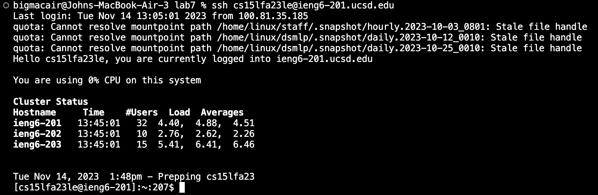
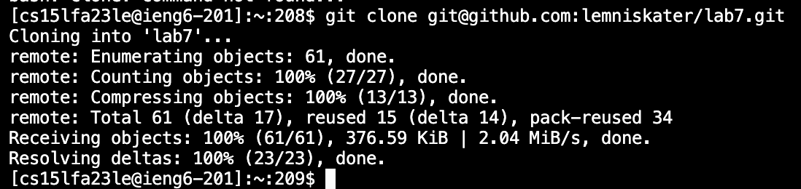
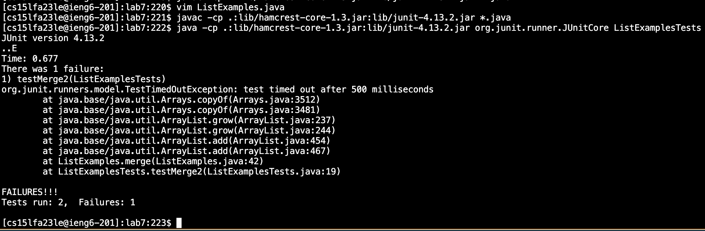
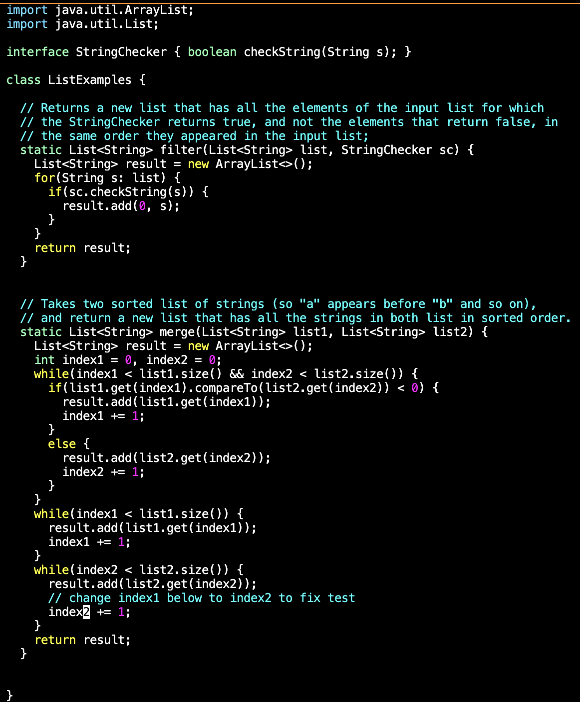
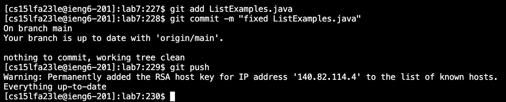

# Lab Report 4 - Vim (Week 7)

4. Log into ieng6

*Keys pressed:* `<up><enter>` the ssh cs15lfa23le@ieng6-201.ucsd.edu command was one up in the search history, so I used one up arrow and enter to input it.

5. Clone your fork of the repository from your Github account (using the SSH URL)

*Keys pressed:* `code`

6. Run the tests, demonstrating that they fail

*Keys pressed:* `code`

7. Edit the code file to fix the failing test

*Keys pressed:* `code`

8. Run the tests, demonstrating that they now succeed

*Keys pressed:* `code`

9. Commit and push the resulting change to your Github account (you can pick any commit message!)

*keys pressed* `code`
