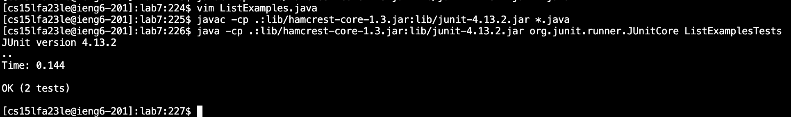

# Lab Report 4 - Vim (Week 7)

4. Log into ieng6

*Keys pressed:* `<up><enter>` the ssh cs15lfa23le@ieng6-201.ucsd.edu command was one up in the search history, so I used one up arrow and enter to input it.

5. Clone your fork of the repository from your Github account (using the SSH URL)

*Keys pressed:* `<command + v><control + a><git><space><clone><enter>` the ssh url was copied from my github repository and pasted into the terminal, I used control + a to get to the beginning of the line and I typed git clone.

6. Run the tests, demonstrating that they fail

*Keys pressed:* `<cd><lab7><enter><control + r><javac><enter><control + r><java><space><enter>` I typed in cd lab7 to get to the correct directory of the cloned repository and then I used the search history function to find the junit compile and run command.

7. Edit the code file to fix the failing test

*Keys pressed:* `<control + r><vim><enter><43jer2:wq><enter>` I used control + r to search the command history for the vim command I used before and once I entered into the vim environment I used my semi-optimized keystroke pattern to get to the correct line and make the correct edits.

8. Run the tests, demonstrating that they now succeed

*Keys pressed:* `<up><up><up><enter><up><up><up><enter>` Once I made the edits from before I used up arrow to get to the junit run commands again.

9. Commit and push the resulting change to your Github account (you can pick any commit message!)

*keys pressed* `<control + r><git add><enter><control + r><git commit><enter><git push><enter>` I used control + r to search the command history to git add the file, git commit it with a comment, then I manually typed git push.
