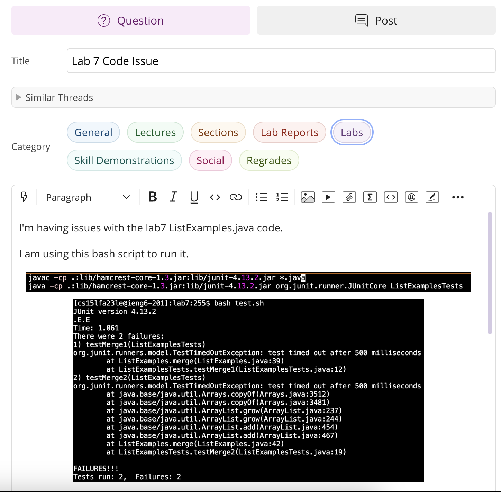
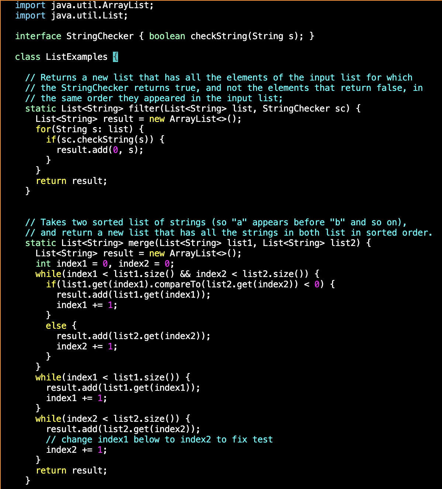

# Lab Report 5 - Putting it All Together (Week 9)
1. The original post from a student with a screenshot showing a symptom and a description of a guess at the bug/some sense of what the failure-inducing input is. (Don’t actually make the post! Just write the content that would go in such a post)

3. A response from a TA asking a leading question or suggesting a command to try (To be clear, you are mimicking a TA here.)

4. Another screenshot/terminal output showing what information the student got from trying that, and a clear description of what the bug is.

 

5. At the end, all the information needed about the setup including:  
  The file & directory structure needed  
  The contents of each file before fixing the bug  
  The full command line (or lines) you ran to trigger the bug  
  A description of what to edit to fix the bug  

  This was done on my ieng6 account in `/home/linux/ieng6/cs15lfa23/cs15lfa23le/lab7` using `ListExamples.java` and `test.sh`.   
  `ListExamples.java` before:   
  
  `bash test.sh` was run to trigger the bugs.  
  
  fixed lines: `line 44 index1 to index2` and `line 39 index2 to index1`
