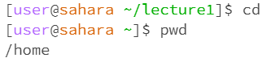
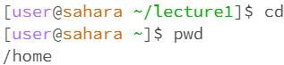
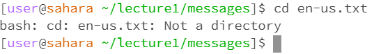
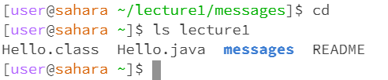
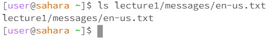
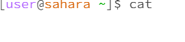
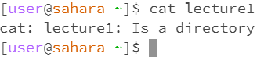
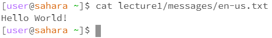

# My Blog for Lab_1

## Using cd

 **without arguments** 
 

 
- cd prints nothing but without arguments the user is brought *all the way out to to the home directory*, the working directory was `/home/lecture1` when run with no arguments. No error here, cd with no arguments brings the user back to the home directory.
  
 **with a path to a directory** 
 

 
- From `/home` I see now I am in the directory I specified which is `lecture1/messages` which is *not an error*.

**with a path to a file as an argument**
  

  
- From `/home/lecture1/messages` it states that the file is not a directory and does nothing, this can be considered an *error* as I used cd on a file which *won't do anything*.

## Using ls

**without arguments**

* In `/home/lecture1/messages` ls prints out all the txt file names present in the messages folder, this is *not an error*. Beyond that ls will print the name of any non-hidden files present within a directory.

**with a path to a directory** 

* In `/home/lecture1/messages` ls can be used to list all the names of files present in the /home/lecture1/messages directory.

**with a path to a file** 

* In `/home` I used ls on `/lecture1/messages/en-us.txt` and it just seems to *print out the path to the specified file*.

## Using cat

**without arguments**

* In `/home` running cat without arguments made it so the terminal read my keyboard inputs. I could exit out of this behavior by pressing `ctrl + c`.

**with a path to a directory** 

* In `/home` I typed `cat lecture1` and it *printed out lecture1 is a directory*. I do not believe this is an error because cat is normally used to print the contents of a file, not a directory. 
**with a path to a file** 

* In `/home` I used cat `/lecture1/messages/en-us.txt` and it *printed out the contents of the .txt file*. 
